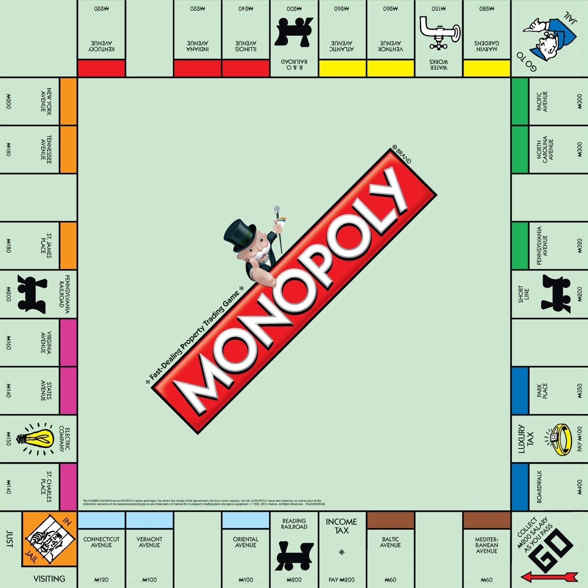

# Monopoly Esilv version
## Introduction
For this project I have to create a kind of Monopoly game where I must use some Design Pattern. In my version, I use a majority of the real Monopolys's rules.

## Game board

For my version I use this game board. As you can see there is some empty case which are nothing case in this version. More over, there isn't the system of Chance and Community Chest cards. But I keep the begin case, the jail case, the tax cases, the go to jail case, the fields, the companies and the railroads.
